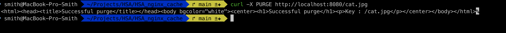

# HSA Nginx cache
Exploring capabilities of Nginx cache

<h3>Task</h3>
* Setup Nginx cache for images
* Allow purge cache for specific image passing cacheKey

<h3>Build</h3>
Add third-party modules to official Nginx image: <br/>
https://github.com/nginxinc/docker-nginx/blob/master/modules/README.md

**My-nginx:** custom Nginx image built with [ngx_cache_purge](https://github.com/nginx-modules/ngx_cache_purge) module

<h3>Description</h3>
Display [stellar](https://html5up.net/stellar) static content under http://localhost:8081

Display and cache image (validate header 'X-Proxy-Cache')<br/>
http://localhost:8080/cat.jpg

Delete cache for specific image <br/>
```
curl -X PURGE http://localhost:8080/cat.jpg
```



